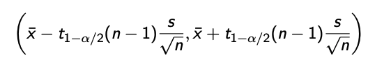

# Week 3

## Exercise 1

Consider the confidence interval for the expected value of the normal distribution on page 2.9 of the lecture notes. Describe what will(most likely) happen to the width of the confidence interval (does it get smaller, larger or stay the same?) if we,

1.  Increase the sample size $n$.
2.  Decrease the confidence level $100(1 - \alpha)$.
3.  Increase the variance $\sigma^2$.
4.  Decrease the expected value $\mu$.

 1. Increasing the sample size decreases the margin of error, decreasing the interval width 1. With common sense the confidence interval gets smaller as the confidence level decreases 1. It gets wider, as the width of the entire distribution does 1. It stays the same, as the shape of the distribution is not affected

## Exercise 2

Consider the following four hypothesis testing scenarios. For each scenario, describe what the Type I error and Type II error mean in that particular context. Comment also on the possible consequences of the two errors in each case (which one of the errors is more "dangerous"?). For part d, come up with a typical hypothesis testing scenario from your own field of science.

1.  A suspect is brought before a judge.

a.  H0: The suspect is innocent.
b.  H1: The suspect is guilty.

2.  A new experimental cancer treatment is compared to placebo. 

a. H0: The new treatment is no better than placebo. 
a. H1: The new treatment is better than placebo.

3.  An automated security screening scans passengers at the airport. H0: The passenger is not carrying dangerous items. H1: The passenger is carrying dangerous items.
